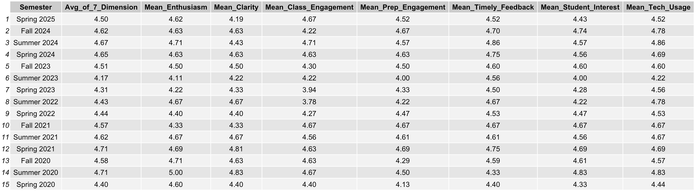
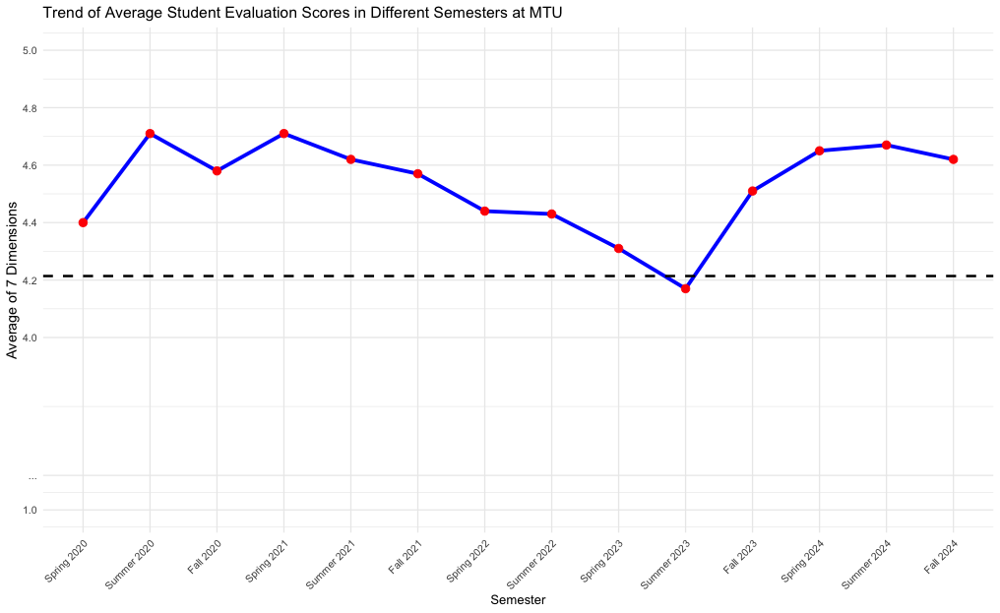
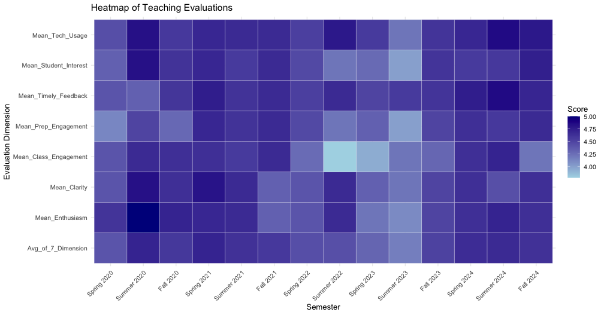
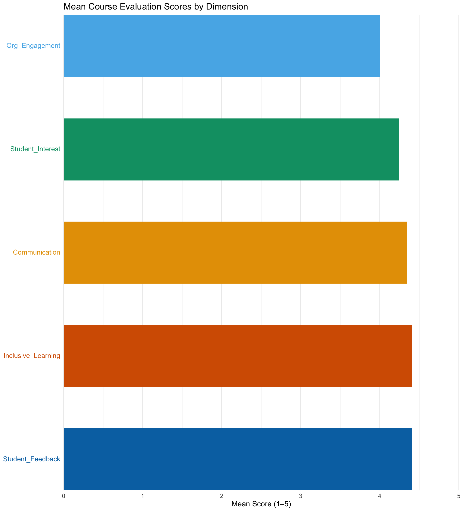

# Achievement 
## Teaching at Michigan Technological University 

At Michigan Technological University (MTU), teaching excellence is a priority in Mathematical Sciences. Graduate instructors complete the **Teaching College Mathematics** course before teaching; 3000-level courses are typically assigned to top GTIs with chair approval.

MTU evaluates instruction using the average of **seven dimensions**:

- **Enthusiasm** — instructor enthusiasm for the subject  
- **Clarity** — clear communication of material  
- **Class Engagement** — in-class participation/engagement  
- **Preparation Engagement** — support for out-of-class preparation/reflection  
- **Timely Feedback** — prompt, high-quality feedback  
- **Student Interest** — interest in students’ learning and development  
- **Technology Usage** — effective use of technology

### Summary of Evaluation Scores (All Semesters)

I instructed **MA 3710: Engineering Statistics** in multiple modalities: in-person, synchronous online, and asynchronous online. The figures below summarize average evaluation scores by semester and by dimension.

{fig-cap="Average student evaluation scores across seven dimensions for each semester."}

::: {.columns}
::: {.column width="47%"}
{fig-cap="Average evaluation score (mean of seven dimensions) by semester. The dashed line at 4.21 marks the overall MTU average over the past seven years."}
:::
::: {.column width="53%"}
{fig-cap="Heatmap of average scores for the seven dimensions by semester."}
:::
:::

**Interpretation.** The table reports average student evaluation scores for each semester across the seven dimensions. The line plot shows consistently strong evaluations at or above **4.21**, the overall MTU average over the past seven years. The heatmap breaks scores out by dimension (e.g., technology use, participation), highlighting strengths and opportunities for improvement.

## Teaching at Macalester College

Macalester College is one of the nation’s leading liberal arts institutions, with a highly diverse student body of about 2,000 undergraduates representing 45 states, the District of Columbia, and more than 70 countries.The college places the highest priority on excellence in teaching and learning.
In Fall 2025, I have instructed STAT 155: Introduction to Statistical Modeling. The course is designed using a flipped classroom format, marking my first experience with this pedagogy. The course survey
included five dimensions of teaching effectiveness.

Macalester College evaluates instruction using the average of **five dimensions**:

- **Communication** — clear communication of course material
- **Organization and Engagement** —  effective course organization and use of class time
- **Availability** — Instructor availability when support is needed
- **Feedback** — quality of feedback on assignments and exams 
- **Inclusive Learning** — facilitating an inclusive learning environment where students feel welcomed and respected

### Summary of Evaluation Scores (Fall 2025)

I instructed **STAT 155: Introduction of Statistical Modeling** in the fall 2025. The figures below summarize average evaluation scores by each dimension.

{fig-cap="Barplot of evaluation scores across dimensions." height=600}

**Interpretation.** Overall performance was strong, with all dimensions scoring at or above 4.00 on a 5-point scale. The highest ratings were observed for Inclusive Learning and Student Feedback (both 4.41), indicating that students felt welcomed, respected, and well supported through timely and constructive feedback. Communication also received a high mean score (4.35), reflecting clarity in presenting course material. Scores for Student Interest (4.24) and Organization and Engagement (4.00) further suggest consistent student engagement and effective use of class time, with room for continued refinement in course organization.

# Awards
## Teaching

- **Recognition Award** for exceptional teaching (7-dimension average), **Fall 2020**  
  - Provost’s Office for Academic Affairs, Michigan Technological University  
  - Among **73 instructors** (86 sections) university-wide rated this highly out of **1,000+** evaluated sections

- **Recognition Award** for outstanding teaching, **Spring 2020**  
  - Provost’s Office for Academic Affairs, Michigan Technological University

## Research
- **Finishing Fellowship**, Michigan Technological University — *Summer 2025*

## Top Student Awards
**Graduate Course Excellence Awards**, Department of Mathematical Sciences, Michigan Technological University  
  - Top performance in Ph.D.-level coursewors:
       - *Probability II* [Spring ’22] 
       - *Probability I* [Fall ’21]
       - *Predictive Modeling* [Fall ’21]
      - *Applied Generalized Linear Model* [Fall ’21]
       - *Computational Statistics* [Spring ’21]
       - *Mathematical Statistics I* [4000 level- Fall ’19, 5000 level- Fall ’20]
       - *Mathematical Statistics II* [4000 level- Spring ’20, 5000 level- Spring ’21]
       - *Categorical Data Analysis* [Spring ’20]
       - *Teaching College Mathematics* [Fall ’19]

  